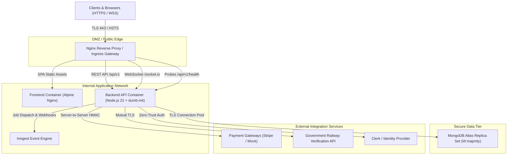
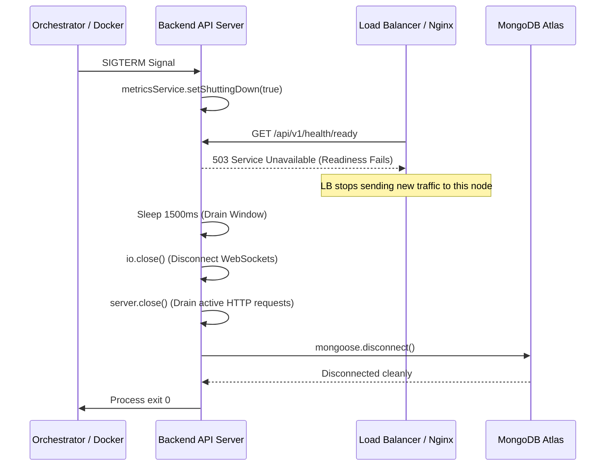

# 🚀 Production Deployment & Operations Guide

## Secure Digital Asset & Ticket Exchange Platform

This document details the production architecture, containerization, environment configuration, observability, security hardening, reverse proxy setup, and operational runbooks for the Secure Digital Asset Exchange Platform.

---

## Table of Contents

1. [Architectural Overview](#1-architectural-overview)
2. [Multi-Environment Configuration](#2-multi-environment-configuration)
3. [Secrets Management & Git Hygiene](#3-secrets-management--git-hygiene)
4. [Docker & Containerization](#4-docker--containerization)
5. [Health, Readiness & Liveness Probes](#5-health-readiness--liveness-probes)
6. [Structured Logging & Observability](#6-structured-logging--observability)
7. [Reverse Proxy, Nginx & HTTPS Configuration](#7-reverse-proxy-nginx--https-configuration)
8. [Database Connection Handling & Pooling](#8-database-connection-handling--pooling)
9. [Graceful Shutdown & Rolling Updates](#9-graceful-shutdown--rolling-updates)
10. [CI/CD Pipeline & Automated Verification](#10-cicd-pipeline--automated-verification)
11. [Production Pre-Flight Checklist](#11-production-pre-flight-checklist)
12. [Disaster Recovery & Operational Runbooks](#12-disaster-recovery--operational-runbooks)

---

## 1. Architectural Overview

The application is architected as a high-security, horizontally scalable microservice ecosystem designed to run behind a TLS-terminating reverse proxy with strict network segregation:



### Key Components

- **Ingress Gateway (`nginx:1.27-alpine`)**: Handles TLS termination, HSTS enforcement, client request limits, rate limiting zones (30 req/s general, 10 req/m auth), HTTP compression, and proxy header forwarding.
- **Frontend SPA (`node:22-alpine` -> `nginx:1.27-alpine`)**: Multi-stage production build serving optimized static React chunks with immutable 1-year cache headers and SPA routing fallbacks.
- **Backend API (`node:22-alpine` + `dumb-init`)**: Stateless Node.js application process running under an unprivileged `node` user with connection pooling, structured JSON logging, and in-flight request draining.
- **Background Orchestrator (`Inngest`)**: Event-driven background job runner providing idempotent workflows, exponential backoff retries, and dead-letter handling.
- **Database (`MongoDB Atlas`)**: Distributed replica set with mandatory TLS, minimum/maximum connection pooling, and strict schema validation.

---

## 2. Multi-Environment Configuration

The platform defines three strictly separated runtime tiers:

| Parameter             | Development                      | Staging                            | Production                          |
| :-------------------- | :------------------------------- | :--------------------------------- | :---------------------------------- |
| **`NODE_ENV`**        | `development`                    | `staging`                          | `production`                        |
| **Config File**       | `.env.development.example`       | `.env.staging.example`             | `.env.production.example`           |
| **Log Format**        | Pretty-printed human logs        | Structured JSON                    | Structured JSON with redaction      |
| **Database**          | Local / Dev Atlas cluster        | Dedicated Staging Replica Set      | Production Multi-Region Replica Set |
| **Cookie Flags**      | `Secure: false`, `SameSite: Lax` | `Secure: true`, `SameSite: Strict` | `Secure: true`, `SameSite: Strict`  |
| **CORS Policy**       | Localhost origins                | Staging subdomains                 | Exact production HTTPS origins only |
| **Auto-Indexing**     | Enabled (`autoIndex: true`)      | Disabled (Run via migrations)      | Disabled (Run via migrations)       |
| **Secret Validation** | Relaxed length checks            | Strict 32+ character entropy       | Strict 32+ char + no default values |

### Environment Variable Specification

| Variable Name             | Required | Default / Format              | Description                                                 |
| :------------------------ | :------: | :---------------------------- | :---------------------------------------------------------- |
| `NODE_ENV`                |   Yes    | `production`                  | Runtime mode: `development`, `staging`, `production`        |
| `PORT`                    |   Yes    | `5000`                        | TCP port the internal Express server binds to               |
| `API_PREFIX`              |   Yes    | `/api/v1`                     | URL version prefix for all public API routes                |
| `MONGODB_URI`             |   Yes    | `mongodb+srv://...`           | MongoDB connection string (must use TLS in production)      |
| `MONGODB_MIN_POOL_SIZE`   |    No    | `5`                           | Minimum maintained connections in MongoDB pool              |
| `MONGODB_MAX_POOL_SIZE`   |    No    | `50`                          | Maximum connections in MongoDB pool                         |
| `JWT_ACCESS_SECRET`       |   Yes    | Cryptographic Key             | Minimum 32 characters; signs short-lived access JWTs        |
| `JWT_REFRESH_SECRET`      |   Yes    | Cryptographic Key             | Minimum 32 characters; signs refresh tokens                 |
| `INTERNAL_ENCRYPTION_KEY` |   Yes    | 64-char Hex Key               | AES-256-GCM key for KYC PII and sensitive data encryption   |
| `PAYMENT_WEBHOOK_SECRET`  |   Yes    | Cryptographic Key             | Minimum 32 characters; verifies payment webhook HMACs       |
| `ADMIN_BOOTSTRAP_TOKEN`   |   Yes    | Cryptographic Key             | Minimum 32 characters; authenticates first-time admin setup |
| `METRICS_AUTH_TOKEN`      |    No    | Cryptographic Key             | Bearer token required for Prometheus scraping endpoint      |
| `CORS_ORIGIN`             |   Yes    | `https://exchange.domain.com` | Allowed HTTPS origin (wildcards rejected in production)     |
| `COOKIE_SECURE`           |   Yes    | `true`                        | Enforces `Secure` flag on all session/refresh cookies       |
| `COOKIE_SAME_SITE`        |   Yes    | `strict`                      | Sets cookie SameSite attribute (`strict`, `lax`)            |
| `TRUST_PROXY`             |   Yes    | `1`                           | Configures Express proxy header trust behind Nginx/ALB      |

---

## 3. Secrets Management & Git Hygiene

> [!CAUTION]
> **Zero Secrets in Git Policy**: Under no circumstances should real API keys, database credentials, or encryption secrets be checked into version control.

### Protective Mechanisms Implemented

1. **Strict `.gitignore` Patterns**:
   Both root and frontend `.gitignore` files contain negative matching rules to completely ignore `.env`, `.env.*`, `*.pem`, `*.key`, and `*.cert` while allowing public example templates (`!.env.*.example`).
2. **Boot-Time Zod Schema Guardrails (`env.config.js`)**:
   In `staging` and `production`, the server runs a `superRefine` pass that immediately terminates the process with exit code `1` if:
   - Secret keys contain known insecure development words (e.g. `dev_secret`, `change_this`, `placeholder`).
   - Secret keys are shorter than 32 characters.
   - `CORS_ORIGIN` uses unencrypted `http://` or wildcards `*`.
   - `MONGODB_URI` points to `localhost` or `127.0.0.1`.
3. **Secret Provisioning in CI/CD**:
   - In GitHub Actions, production secrets are injected via GitHub Actions **Repository Secrets** / **Environment Secrets**.
   - In container deployments, secrets are mounted as Docker Secrets or injected via a secure Vault (e.g., HashiCorp Vault, AWS Secrets Manager, or Google Cloud Secret Manager).

---

## 4. Docker & Containerization

### Building Production Images

Build images locally or in CI using the multi-stage Dockerfiles:

```bash
# 1. Build Backend API Image
docker build -t secure-exchange-backend:latest ./backend

# 2. Build Frontend Web Image (with build args)
docker build \
  --build-arg VITE_API_URL=/api/v1 \
  --build-arg VITE_WS_URL=/ \
  -t secure-exchange-frontend:latest ./frontend
```

### Multi-Stage Dockerfile Highlights

- **Backend (`backend/Dockerfile`)**:
  - Stage 1 installs dependencies with `--omit=dev --ignore-scripts`.
  - Stage 2 copies only production modules into a fresh `node:22-alpine` image.
  - Installs `dumb-init` to handle POSIX PID 1 signal forwarding cleanly.
  - Drops privileges to standard non-root user `USER node`.
  - Defines internal Docker health check running native Node fetch.

- **Frontend (`frontend/Dockerfile`)**:
  - Stage 1 compiles React SPA source code into static assets via Vite.
  - Stage 2 copies output into `nginx:1.27-alpine` serving assets with gzip, security headers, and caching.

### Docker Compose Profiles

- **Development**:
  ```bash
  docker compose -f docker-compose.yml up -d --build
  ```
- **Staging**:
  ```bash
  docker compose -f docker-compose.staging.yml up -d --build
  ```
- **Production**:
  ```bash
  docker compose -f docker-compose.prod.yml up -d --build
  ```

---

## 5. Health, Readiness & Liveness Probes

The backend exposes industry-standard probes compatible with Kubernetes, AWS ALB, Docker, and Prometheus:

| Endpoint                     | Method | Purpose                                                  | Normal Response                         | Failure / Degraded Response       |
| :--------------------------- | :----: | :------------------------------------------------------- | :-------------------------------------- | :-------------------------------- |
| **`/api/v1/health`**         | `GET`  | Comprehensive system health & telemetry                  | `200 OK` (Full JSON diagnostics)        | `503 Service Unavailable`         |
| **`/api/v1/health/live`**    | `GET`  | **Liveness Probe**: Confirms process event loop is alive | `200 OK` (`{"status":"live"}`)          | Process non-responsive (timeout)  |
| **`/api/v1/health/ready`**   | `GET`  | **Readiness Probe**: Confirms DB is connected & ready    | `200 OK` (`{"status":"ready"}`)         | `503 Service Unavailable`         |
| **`/api/v1/health/metrics`** | `GET`  | Prometheus & JSON telemetry scraping                     | `200 OK` (Prometheus exposition format) | `401 Unauthorized` (if token set) |

### Liveness vs Readiness Semantics

- **Liveness (`/health/live`)**: Answers _"Should the orchestrator kill and restart this container?"_ If this fails or hangs, the container has deadlocked.
- **Readiness (`/health/ready`)**: Answers _"Should the load balancer send client requests to this container?"_
  - Returns `503` if MongoDB connection is broken.
  - Returns `503` immediately when `SIGTERM` / `SIGINT` is received, preventing new requests from being routed to a dying instance while in-flight requests finish draining.

---

## 6. Structured Logging & Observability

### JSON Logging Standard

In `staging` and `production`, the backend outputs structured NDJSON (Newline Delimited JSON) via `pino`:

```json
{
  "level": 30,
  "time": 1727787471803,
  "pid": 16252,
  "hostname": "backend-prod-789bf",
  "requestId": "c1f7a840-9a2e-4b62-bb34-8c8872bca5ef",
  "method": "POST",
  "url": "/api/v1/listings/reserve",
  "statusCode": 200,
  "durationMs": 42,
  "msg": "HTTP POST /api/v1/listings/reserve 200 (42ms)"
}
```

### Correlation IDs

Every inbound request is assigned a unique `X-Request-Id` UUID via `request-logger.middleware.js`. The correlation ID is:

- Attached to the request lifecycle (`req.requestId`).
- Accessible in child loggers (`req.log.info(...)`).
- Returned in the HTTP response headers (`X-Request-Id: ...`) for client-side tracing.

### Automatic Sensitive Data Redaction

Pino automatically redacts the following sensitive fields from logs:

- `req.headers.authorization`
- `req.headers.cookie`
- `*.password`, `*.currentPassword`, `*.newPassword`
- `*.cardNumber`, `*.pan`, `*.cvv`, `*.pin`
- `*.rawIdDocumentData`, `*.syntheticIdentityData`

---

## 7. Reverse Proxy, Nginx & HTTPS Configuration

The Nginx reverse proxy configuration (`nginx/conf.d/default.conf`) guarantees edge security:

### Ingress Routing Rules

1. **`/api/v1/health*`**: Direct bypass to backend with 5s timeout, free from rate limits to avoid false-positive health check drops.
2. **`/api/v1/auth/*`**: Strict rate limit zone (`auth_limit`: 10 req/min, burst 5) to protect against brute-force attacks.
3. **`/api/v1/*`**: General API rate limit zone (`api_limit`: 30 req/sec, burst 20).
4. **`/socket.io/*`**: Full WebSocket upgrade headers (`Upgrade: $http_upgrade`, `Connection: "upgrade"`) with extended 24-hour read/send timeouts.
5. **`/`**: Static SPA assets served with browser caching and Single Page Application fallback (`try_files $uri $uri/ /index.html`).

### Production SSL Termination

To enable HTTPS with custom or Let's Encrypt certificates:

1. Place SSL certificates in `./nginx/certs/`:
   - `fullchain.pem`
   - `privkey.pem`
2. Enable `nginx/conf.d/ssl.conf.template` by copying it to `nginx/conf.d/ssl.conf`.
3. The server will automatically redirect all plain HTTP (port 80) traffic to port 443 with HSTS headers (`Strict-Transport-Security: max-age=31536000; includeSubDomains; preload`).

---

## 8. Database Connection Handling & Pooling

MongoDB connection management (`db.config.js`) enforces resilient connection pooling:

```javascript
const options = {
  minPoolSize: env.MONGODB_MIN_POOL_SIZE, // Keeps warm connections ready (default: 5)
  maxPoolSize: env.MONGODB_MAX_POOL_SIZE, // Caps connection concurrency (default: 50)
  serverSelectionTimeoutMS: 5000, // Fails fast if cluster unreachable
  autoIndex: env.NODE_ENV !== 'production', // Prevents costly background index builds in prod
};
```

### Reconnection & Resilience

- Mongoose event listeners monitor `connected`, `disconnected`, and `reconnected` events.
- In production, if the initial connection fails at boot, the application exits cleanly with code `1` so orchestrators can reschedule the container.
- If an existing connection drops during runtime, Mongoose automatically enters reconnection backoff while `/api/v1/health/ready` transitions to `503 Service Unavailable`.

---

## 9. Graceful Shutdown & Rolling Updates

The backend implements a two-phase graceful shutdown protocol on `SIGTERM` and `SIGINT`:



### Zero-Downtime Rolling Update Command

```bash
# Update backend image without dropping client requests:
docker compose -f docker-compose.prod.yml up -d --no-deps --build backend
```

---

## 10. CI/CD Pipeline & Automated Verification

The automated pipeline (`.github/workflows/ci-cd.yml`) executes on every commit and pull request:

```
[Quality Gate]
├── Prettier format verification (npm run format:check)
├── Fast static analysis (npm run lint)
└── Dependency vulnerability audit (npm run audit)
      │
      ▼
[Automated Test Gate (MongoDB Service Container)]
├── Database connection validation
├── Payment abstraction & zero-trust verification tests (58 tests)
├── Backend security penetration suite (38 attack vectors)
├── Administrative moderation & RBAC suite (75 tests)
├── Inngest idempotent background jobs suite (57 tests)
├── Backend syntax & bootstrap compilation (npm run build --prefix backend)
└── Frontend production bundle build (npm run build --prefix frontend)
      │
      ▼
[Container Build Gate]
├── Multi-stage backend Docker build & lint
└── Multi-stage frontend Docker build & lint
      │
      ▼
[Deployment Gate]
├── Staging Deployment (on staging branch)
└── Production Deployment (on main branch with manual approval)
```

---

## 11. Production Pre-Flight Checklist

Before launching to live traffic, verify each of the following controls:

- [ ] **DNS & TLS**: Domain points to Nginx reverse proxy; TLS certificates are valid and renew automatically.
- [ ] **Environment Secrets**: All secrets in `.env.production` are minimum 32 random alphanumeric characters and not default strings.
- [ ] **HTTPS Enforced**: `COOKIE_SECURE=true`, `CORS_ORIGIN=https://your-domain.com`.
- [ ] **Database Network Whitelist**: MongoDB Atlas IP access list allows only the production server/VPC static IP.
- [ ] **Database User**: MongoDB user has least-privilege credentials constrained to `secure_asset_exchange` database.
- [ ] **Health Probes Active**: Load balancer checks `/api/v1/health/ready` at 10-second intervals.
- [ ] **Reverse Proxy Rate Limits**: Nginx rate limit zones verified with `nginx -t`.
- [ ] **Log Retention**: Log rotation policy configured (`max-size: 50m`, `max-file: 10`).
- [ ] **Prometheus Alerting**: Alert rules configured for memory usage > 85%, HTTP 5xx rate > 1%, and database disconnection.

---

## 12. Disaster Recovery & Operational Runbooks

### 1. Database Connection Outage

- **Symptom**: `/api/v1/health/ready` returns 503; logs report `MongoDB connection lost`.
- **Action**: Check Atlas cluster status. Mongoose will automatically reconnect once DNS resolves. If cluster switched primary, connections will re-negotiate within 10 seconds.

### 2. Rolling Back a Bad Release

```bash
# Revert to previous Git commit or image tag
git checkout <previous-stable-tag>
docker compose -f docker-compose.prod.yml up -d --build
```

### 3. Emergency Admin Bootstrap

If locked out of administrative access:

```bash
curl -X POST https://your-domain.com/api/v1/auth/bootstrap-admin \
  -H "Authorization: Bearer <ADMIN_BOOTSTRAP_TOKEN>" \
  -H "Content-Type: application/json" \
  -d '{"email":"admin@yourdomain.com","name":"Super Admin"}'
```

### 4. Inspecting Live System Metrics

```bash
# JSON Snapshot
curl -s https://your-domain.com/api/v1/health | jq .

# Prometheus Text Format
curl -s -H "Accept: text/plain" https://your-domain.com/api/v1/health/metrics
```

---

_Secure Asset Exchange Platform — Built for high-reliability, zero-trust digital asset transfers._
